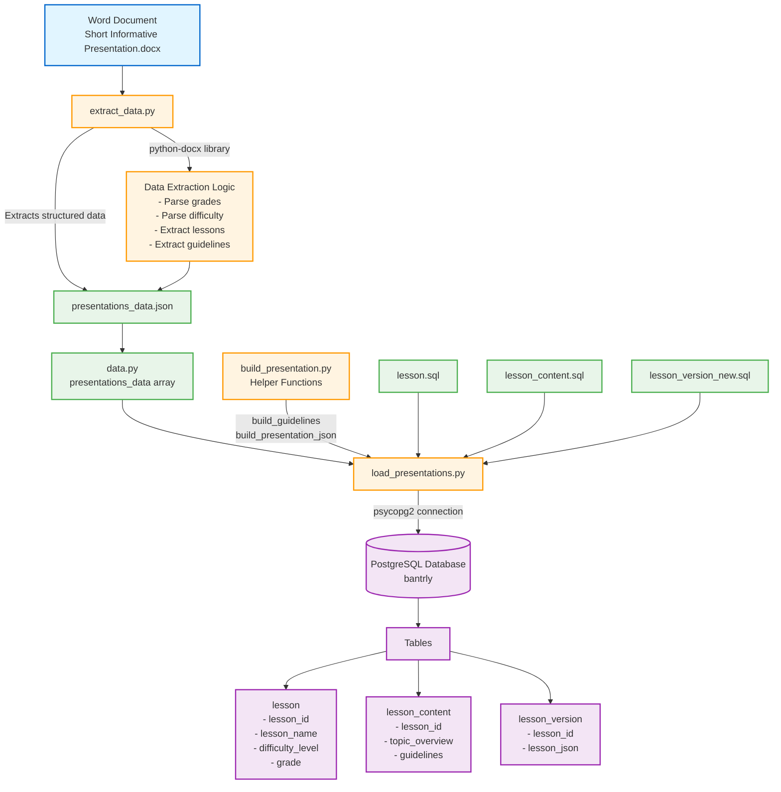

# Short Presentation System - Architecture Diagram

## System Overview
This system extracts presentation lesson data from Word documents, transforms it into structured JSON, and loads it into a PostgreSQL database for educational content management.

## Architecture Diagram



## Data Flow

```
┌─────────────────────────────────────────────────────────────────┐
│                        INPUT PHASE                              │
├─────────────────────────────────────────────────────────────────┤
│  Word Document (.docx)                                          │
│  ├─ Grade 11, 12 (organized by grade)                          │
│  ├─ Difficulty: EASY, MEDIUM, HARD                             │
│  └─ Lessons with:                                               │
│      ├─ Lesson Name                                             │
│      ├─ Topic Overview                                          │
│      └─ Preparation Guidelines                                  │
└─────────────────────────────────────────────────────────────────┘
                              ↓
┌─────────────────────────────────────────────────────────────────┐
│                      EXTRACTION PHASE                           │
├─────────────────────────────────────────────────────────────────┤
│  extract_data.py                                                │
│  ├─ Read DOCX using python-docx                                │
│  ├─ Parse with regex patterns                                  │
│  ├─ Extract structured lesson data                             │
│  └─ Output: presentations_data.json                            │
└─────────────────────────────────────────────────────────────────┘
                              ↓
┌─────────────────────────────────────────────────────────────────┐
│                     TRANSFORMATION PHASE                        │
├─────────────────────────────────────────────────────────────────┤
│  build_presentation.py (Helper Functions)                       │
│  ├─ build_guidelines(points)                                    │
│  │   └─ Joins guideline points with "."                        │
│  └─ build_presentation_json(data)                              │
│      └─ Creates structured JSON with:                          │
│          ├─ lesson_name, description, grade                     │
│          ├─ difficulty_level, lesson_type                       │
│          └─ contents array (topic, guidelines, examples)        │
└─────────────────────────────────────────────────────────────────┘
                              ↓
┌─────────────────────────────────────────────────────────────────┐
│                       LOADING PHASE                             │
├─────────────────────────────────────────────────────────────────┤
│  load_presentations.py                                          │
│  ├─ Connect to PostgreSQL (psycopg2)                           │
│  ├─ For each lesson:                                           │
│  │   ├─ Execute lesson.sql → get lesson_id                    │
│  │   ├─ Execute lesson_content.sql                            │
│  │   └─ Execute lesson_version_new.sql                        │
│  └─ Commit transaction                                         │
└─────────────────────────────────────────────────────────────────┘
                              ↓
┌─────────────────────────────────────────────────────────────────┐
│                      DATABASE LAYER                             │
├─────────────────────────────────────────────────────────────────┤
│  PostgreSQL Database: bantrly                                   │
│  ├─ lesson table                                               │
│  │   └─ Core lesson metadata                                  │
│  ├─ lesson_content table                                       │
│  │   └─ Lesson content details                                │
│  └─ lesson_version table                                       │
│      └─ Full JSON representation                               │
└─────────────────────────────────────────────────────────────────┘
```

## Component Details

### 1. Input Source
- **File**: `_Short Informative Presentation.docx`
- **Format**: Structured Word document with lessons organized by grade and difficulty
- **Content**: Educational presentation topics with guidelines

### 2. Extraction Module
- **Script**: [extract_data.py](extract_data.py)
- **Dependencies**: python-docx
- **Function**: Parses Word document and extracts structured lesson data
- **Output**: [presentations_data.json](presentations_data.json)

### 3. Data Storage
- **Script**: [data.py](data.py) (or curriculum_data.py)
- **Format**: Python list of dictionaries
- **Purpose**: In-memory representation of presentation data

### 4. Transformation Module
- **Script**: [build_presentation.py](build_presentation.py)
- **Functions**:
  - `build_guidelines(points)`: Joins guideline points
  - `build_presentation_json(data)`: Creates standardized JSON structure

### 5. Database Loader
- **Script**: [load_presentations.py](load_presentations.py)
- **Database**: PostgreSQL (bantrly)
- **Connection**: psycopg2
- **SQL Scripts**:
  - [lesson.sql](lesson.sql): Inserts lesson metadata
  - [lesson_content.sql](lesson_content.sql): Inserts content details
  - [lesson_version_new.sql](lesson_version_new.sql): Stores JSON version

### 6. Database Schema
- **lesson**: Core lesson information (ID, name, grade, difficulty)
- **lesson_content**: Detailed content (topic overview, guidelines)
- **lesson_version**: JSON representation for API consumption

## Technology Stack

| Layer | Technology |
|-------|-----------|
| Input | Microsoft Word (.docx) |
| Extraction | Python, python-docx, regex |
| Data Format | JSON |
| Transformation | Python |
| Database | PostgreSQL |
| Database Driver | psycopg2 |
| Data Structure | Relational (normalized tables) |

## Workflow Summary

1. **Create** lesson content in Word document
2. **Extract** data using extract_data.py → JSON file
3. **Load** data using load_presentations.py
4. **Transform** using build_presentation.py helpers
5. **Store** in PostgreSQL across three normalized tables
6. **Access** via database queries for application use
